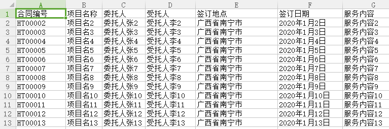
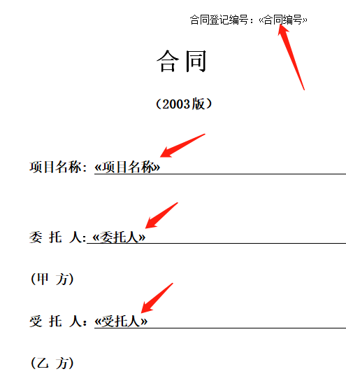

# 合同批量生成软件
当使用固定合同模板时，只是合同要素（比如：甲方名称、乙方名称、项目名称等等）不同，可使用本软件批量生成合同。  

使用方法：  
1、从release目录中下载最新zip压缩包文件，解压缩。  
2、双击运行“极简合同.exe”即可运行软件。从“帮助”目录可以查看帮助文件和示例数据。  

如果有问题，请发Email至techinged@qq.com或者430353916@qq.com 

软件运行界面如下截图所示：  
    

每份合同的合同要素信息整理在Excel文件中，如下截图所示：  
      

合同模板的设置如下截图所示，届时Excel表对应列的合同要素信息会填充到合同模板的相应位置，生成对应的合同文件。    
      
